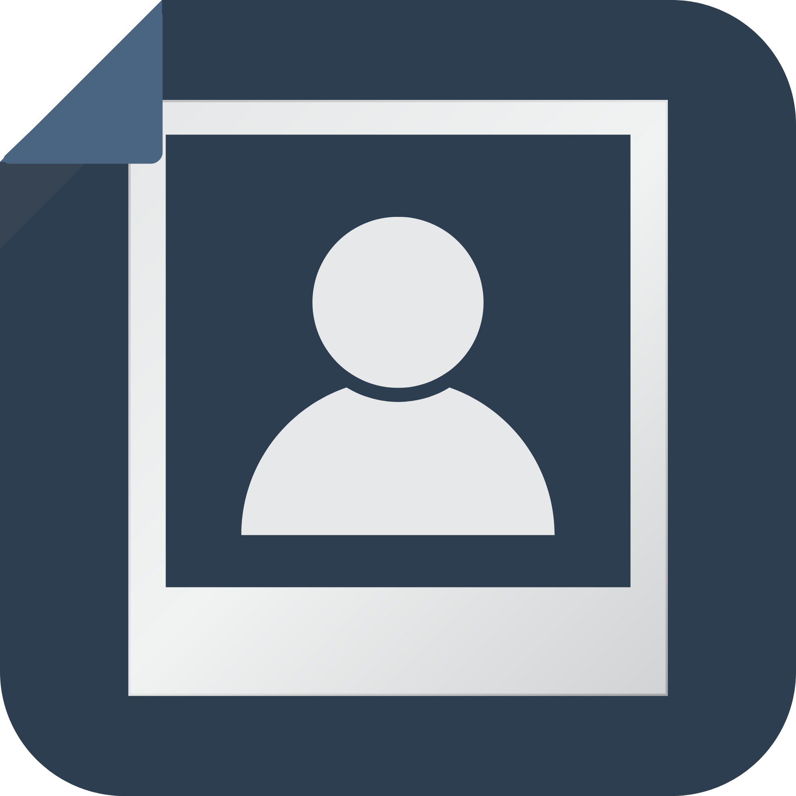

  
  <h1>photools</h1>
  
<strong>Desktop Photo Printing Software</strong>

  

    
    
    
    
  

 

## About The Application

**photools** is a desktop software solution specifically designed to accelerate and standardize the photo printing process for print shops. It aims to eliminate manual methods that consume time, cause sizing errors, and waste paper or ink.

The application comes with various features designed for non-technical operators to shorten the workflow:

* **Auto-Layout Grid:** Automatically arrange photos onto the paper. The application calculates exactly how many photos fit in a single sheet with customizable margins and spacing.
* **Dynamic Theme Support:** Seamlessly switches between Light and Dark modes, adapting to your system preferences.
* **Professional Splash Screen:** A modern startup experience with a two-panel layout (inspired by Adobe Photoshop).
* **Smart Size Sync:** Real-time synchronization between the photo list and settings panel for accurate printing.
* **Comprehensive Print Sizes:** Supports standard presets (2x3, 3x4, 4R, etc.) as well as custom sizes with automatic DPI/pixel conversion.
* **Diverse Paper Support:** Choose paper sizes ranging from A4, F4/Folio, B3, to Legal, with Portrait or Landscape orientation.
* **Quick Crop & Rotate:** Adjust photo ratios to match the selected print size without needing external applications.
* **Direct Export & Print:** Send directly to your installed printer or export the layout as a high-resolution PDF/image.

## Right to Use

This application is **completely free to use**. You are allowed to use it for personal, commercial, or print shop operations without any licensing fees. 

The software runs 100% offline, ensuring your data and photos remain entirely on your local machine.

## System Requirements

* **Operating System:** Windows 10 or Windows 11 (64-bit recommended).
* **RAM:** Minimum 4GB (8GB recommended for processing large batches of photos).
* **Storage:** 200 MB free space for installation.
* **Internet Connection:** Not required (Application runs 100% offline).

## Quick Usage Guide

1. Open the application, click **Import Photo** (or drag-and-drop).
2. Select the print size (e.g., 3x4) and crop/rotate if necessary.
3. Select the printing paper size (e.g., A4) and orientation.
4. The application will automatically display a preview of the photo arrangement (auto-layout).
5. Click **Print** to send to the printer, or **Export** to save as a PDF/image.

## Contact Support

If you encounter any issues or have questions, please reach out to:
**[farisikbal304@gmail.com](mailto:farisikbal304@gmail.com)**
